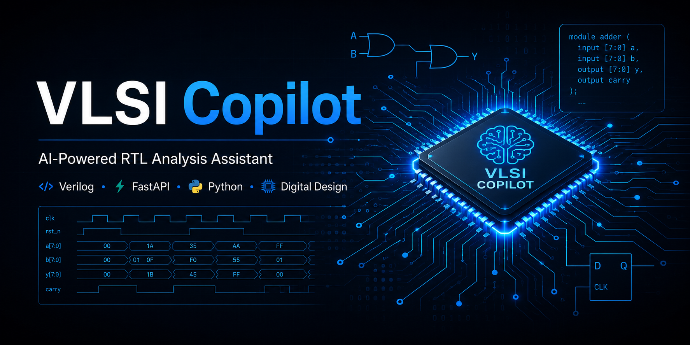
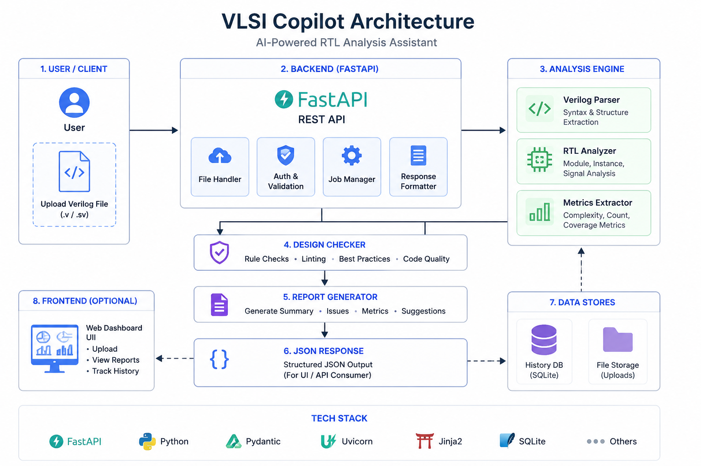
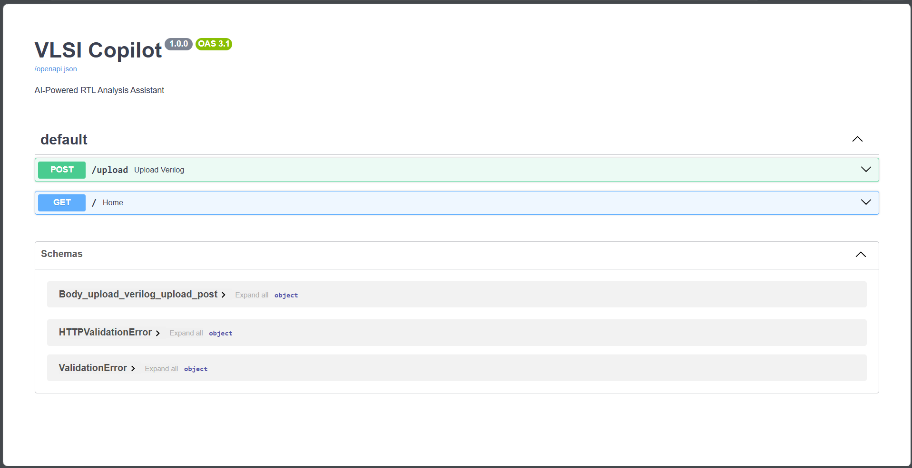
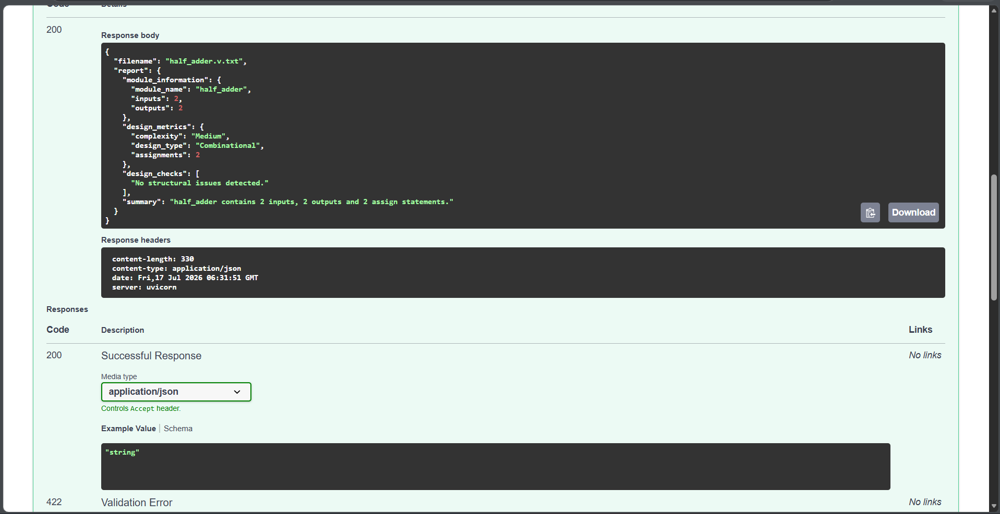
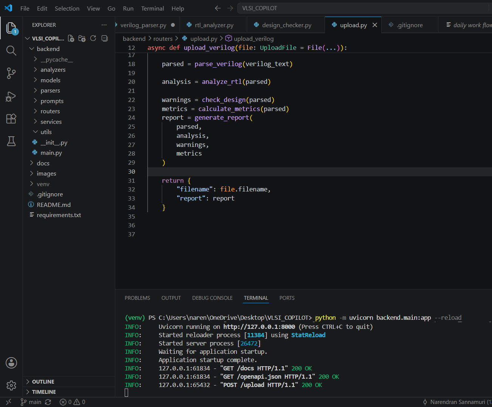

# VLSI Copilot



## Overview

VLSI Copilot is an AI-assisted RTL analysis platform for Verilog designs.

It helps engineers and students analyze Verilog modules, detect structural issues, calculate design metrics, and generate engineering reports.

---

## Features

- Upload Verilog RTL
- Parse Verilog modules
- RTL structural analysis
- Design metrics
- Design warnings
- Engineering report generation

---

## Tech Stack

- Python
- FastAPI
- Git
- Verilog
- Regex Parsing

---

## Project Architecture



---

## Screenshots

### Swagger API



### Upload Response



### Project Structure



---

## Folder Structure

```text
backend/
    analyzers/
    parsers/
    routers/
    services/

images/

docs/
```

---

## Future Roadmap

- Verilog Testbench Generator
- FSM Detection
- Timing Report Analysis
- AI RTL Reviewer
- Syntax Error Detection
- Web Dashboard

---

## Author

Narendran Sannamuri
ECE Student
Aspiring VLSI Physical Design Engineer